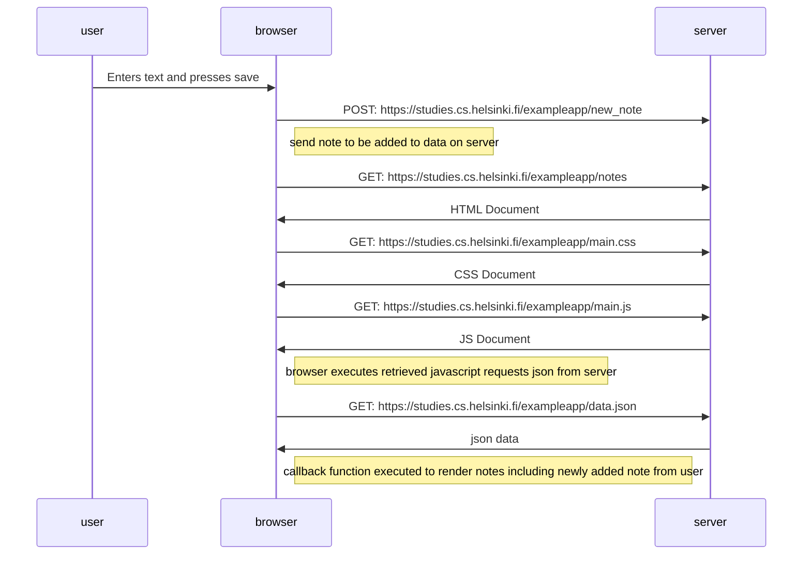

```mermaid
sequenceDiagram
    participant user;
    participant browser;
    participant server;

    user->>browser: Enters text and presses save;
    browser->>server: POST: https://studies.cs.helsinki.fi/exampleapp/new_note
    note right of browser: send note to be added to data on server

    browser->>server: GET: https://studies.cs.helsinki.fi/exampleapp/notes
    server->>browser: HTML Document

    browser->>server: GET: https://studies.cs.helsinki.fi/exampleapp/main.css
    server->>browser: CSS Document

    browser->>server: GET: https://studies.cs.helsinki.fi/exampleapp/main.js
    server->>browser: JS Document
    note right of browser: browser executes retrieved javascript requests json from server

    browser->>server: GET: https://studies.cs.helsinki.fi/exampleapp/data.json
    server->>browser: json data
    note right of browser: callback function executed to render notes including newly added note from user
```
