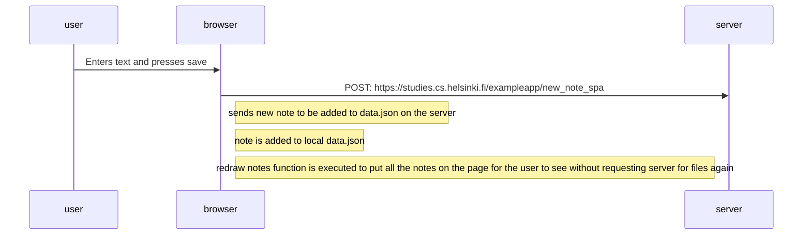

```mermaid
sequenceDiagram
    participant user;
    participant browser;
    participant server;

    user->>browser: Enters text and presses save;
    browser->>server: POST: https://studies.cs.helsinki.fi/exampleapp/new_note_spa
    note right of browser: sends new note to be added to data.json on the server
    note right of browser: note is added to local data.json
    note right of browser: redraw notes function is executed to put all the notes on the page for the user to see without requesting server for files again

```
