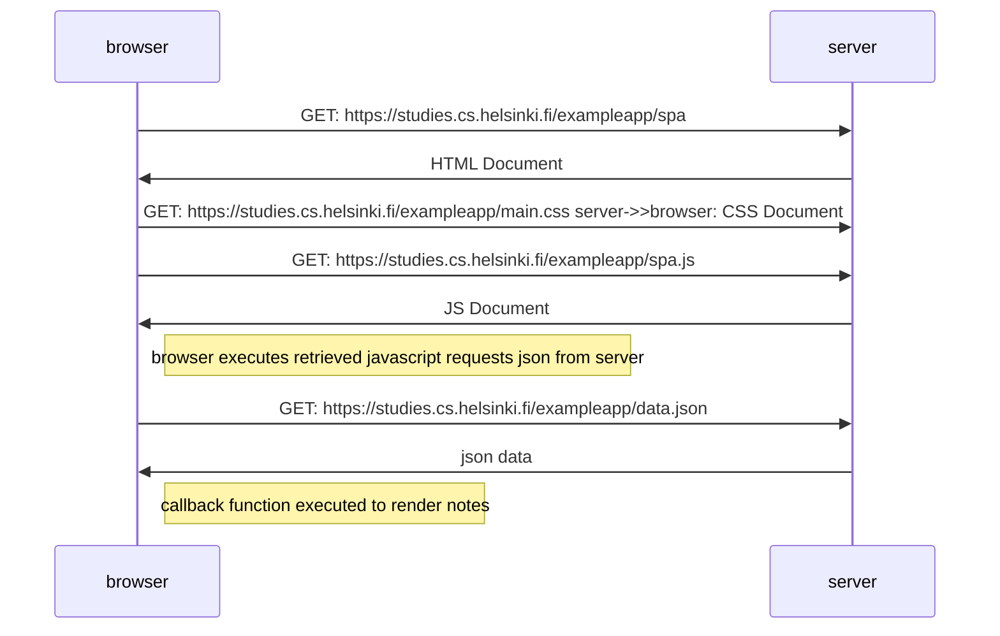

```mermaid
sequenceDiagram
    participant browser;
    participant server;

    browser->>server: GET: https://studies.cs.helsinki.fi/exampleapp/spa
    server->>browser: HTML Document

    browser->>server: GET: https://studies.cs.helsinki.fi/exampleapp/main.css   server->>browser: CSS Document

    browser->>server: GET: https://studies.cs.helsinki.fi/exampleapp/spa.js
    server->>browser: JS Document
    note right of browser: browser executes retrieved javascript requests json from server

    browser->>server: GET: https://studies.cs.helsinki.fi/exampleapp/data.json
    server->>browser: json data
    note right of browser: callback function executed to render notes
```
